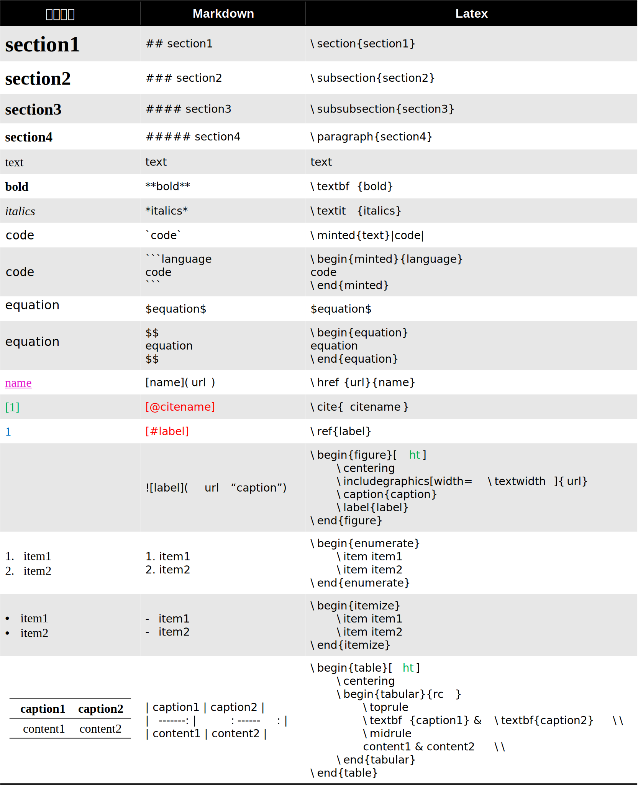

# MD2TEX

一个还在不断改进的Markdown转Latex工具，基于正则表达式。

主要是由于pandoc用起来感觉十分奇怪，故自己写一个。

## 快速使用

只有一个文件，非常方便

你需要准备两个必需文件和一个可选文件，一是本仓库的`md2tex.py`文件，二是待转换文件`report.md`，可选的是tex模板文件`template.tex`。

当然，没有模板文件也是可以的，这样输出的文件无法被直接编译，但是方便其他文件进行调用。

其中`template.tex`文件是一个模板文件，仅仅具备提供模板的功能，一个可用的template.tex如下所示，该文件在本仓库的`/report/template.tex`路径下。

```tex
\documentclass{ctexart} % 支持ctexart, article
\usepackage{subcaption,hyperref,booktabs,float,amsmath,graphicx}
\usepackage[cache=false]{minted}
% 上面是必要的包

\begin{document}

% ----- begin md -----

% 中间这部分内容将会被舍去
% 在begin md和end md之外的内容可以进行更改以达到你满意的排版格式

% ----- end md -----

\bibliographystyle{ieeetr}
\clearpage
\bibliography{reference}
\end{document}
```

其中，`% ----- begin md -----`以及`% ----- end md -----`必须出现在`template.tex`模板文件中，这是识别符号。

三个文件准备完成后，只需要在终端输入如下指令便可以完成转换，这时候`report.md`以及`template.tex`都放在了指定目录下，也就是`./report`中，并且会将生成的tex文件保存在`./report/report.tex`中。

```bash
python md2tex.py
```

如果需要改变输入输出以及模板文件的路径，可以使用如下的更为详细的代码。

```bash
python md2tex.py --md-file <input_file_path> --tex-file <output_file_path> --template <template_path>
```

## 实现功能

下表列出了所实现的转换关系，其中，<span style="color:red">红色</span>部分的Markdown语法无法被渲染，仅是为了链接使用而设置。<span style="color:green">绿色</span>部分的Latex语法，也就是关于图片和表格的位置定位功能可以被改变。



## 使用要求与不足

- 在**正文**中不能够出现下划线`_`，若无法避免请使用`\_`替代；
- 无法使用`_text_`表示斜体，请使用`*text*`以替代；
- 暂时无法实现列表的嵌套功能，无论是有序列表还是无序列表；
- 暂时无法为表格添加标题以及跳转标签；
- 最后一行需要以正文结尾，尽量不要使用表格、列表等多行环境结尾；
- 请使用Typora等Markdown编辑器进行语法编辑，对于某些个性化写法无法支持；
